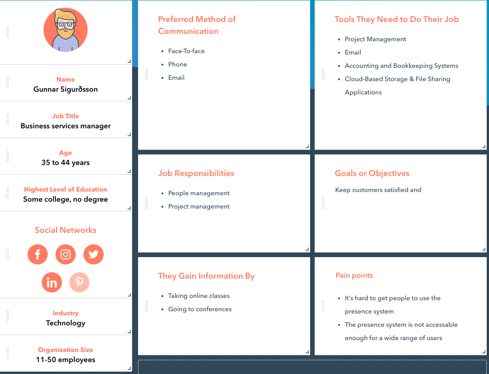

# Design UX - User Research (I)

## Precense system

### Problem statement - Goal

In this day and age of a pandemic where a lot of people work remotly, it can sometimes be hard to know if your college is at their desk, on the phone or out of "office".
I want to create a precense system that efficiently shows the status of co-workers.

### Primary User

- Office workers
- Remote office workers
- Call centers

## Interview script

### do's and don'ts

- Do
  - Ask open ended questions
  - Let the respondant have some time to think and answer
  - Acknowlage the answers
- Don't
  - Ask leading questions
  - Fill silences
  - Ask yes/no questions
  - Interrupt the respontant
  - Take notes during the interview

### Intro - About the interview and the project

### Introduction - Little bit about me and why I'm doing this

### Let's get to know the respondant

- Age
- Position / Employment
  - Working remotly or in the Office
- Experience

### Specified Details - Questions related to the project

_Potential answer_

- In your current job, how do you tell if your college is at their desk or not?
  - _Currently using presence system_
    - How do you feel about using the presence system?
    - Do you feel the presence system is useful for your work enviornment?
    - What do you think could improve the presence system?
    - What do you think is missing from the presence system?
  - _Not using presence system_
    - Have you used a system simular to the one described before in your current or past work?
      - _Have used a presencee system but not using one currently_
        - Would a simular presence system work or be benificial at your current work
        - How did you feel about using the presence system?
      - _Have never used presence sytem but know what it is_
      - _Have never used or heard of a presence sytem_

### Outro - Finishing the interview

## Interviews

### 1st interview

- 30 years old
- Works remotely as a service representative at Securitas
- Lives in Bolungarvík but workplace is in Reykjavík
- Uses teams or direct calls to see the status of co-workers
  - Uses away/busy status on teams
- Has never used a presence system
- Would like to have a presence system at her current job
  - Would like to be able to see who is logged in to the phone system and who is not to tell who is avalible for phone calls.
- Would like to know when people are expected to be avalible
- Would be useful to see who is on a call and who has an open line
- Using Teams to see peoples status is chaotic and unreliable

### 2nd interview

- 24 years old
- Works at a call center where he answers calls for many companies both as a switchboard and customer service
- Work is mixed, sometimes at the office, mostly remote recently
- Him and his co-workers use the phone system to let others know if they are avalible or not.
  - They also use workplace to schedule lunch times for each staff member.
  - He feels that a dedicated presence system would not be benificial for them
- A dedicated presence system would be benificial for many of their customers
  - A connection between the presence system and the phone system would be nice to have on those customers
- Some of their customers have a presence system that the call center has access to.
- For customers that don't have a presence system they use direct calls to check if that person is avalible.
  - Use email commuication at start of day and manually add to a file about sick leave or vaction
- He feels that it's better/easier to service companies that have a presence system **if the system is properly used**
- Biggest problem with presence systems is that staff members don't use them
- Feels that the usage of presence system could be improved by
  - Having it connected to the users calendar
  - Having a plug-in for internal systems that staff use through out the day, that way users don't need to go to another system to change their status

### 3rd interview

- Q: Personal detail
  - 42 years old
  - Is business services manager at Snerpa
  - Work is mostly sales to customers and project management for the business services department
  - Works mostly at the office, but sometimes remotely
- Q: How can you tell whether your co-workers are at there desk, working remotely or on vacation for example?
  - Can stand up to check if that person is at their desk
  - Have a presence system where staffmembers can set their status and add a comment for where they are
  - Uses teams to see if user is actively at their computer
- Q: How could the presence system be imporved?
  - Presence system needs some automation
    - Could have a opt-in geo tracking
    - Something simular to teams where it shows when you have not been active
  - Presence system works fine when people remeber to use it
  - So many different jobs at the workplace so the presence system has to have different ways to check-in/out
    - Office works might have desktop/phone app
    - Outdoor workers could have a check-in/out station a the door (rfid scanner or tablet at the door)
    - Phone app that is easy to use
- Q: What do you think is missing from the system?
  - Want's to be able to see checked out/in history, and what comment was added.
  - There is an option to save a comment to an action but no option to delete or edit that state and it can get cluttered.

## Pain points

The biggest pain point regarding presence systems seems to be the lack of usage, I think this can be fixed by making the system more accessable to users, have more options to log their status other then a web page, it can also be improved with some automation (Activety at the computer and geo-tracking for example)

## Must-Should-Could-Won't have

### Must have

- Status
  - Avalible / Busy / Away / On vacation
- Expected return when status is away
- Live updates, don't have to refresh
- Multiple ways of changing status
  - Mobile App
  - Check-in/out station (Tablet or rfid card reader at the door for example)
  - Desktop app
  - Web app
  - Automation
    - Inactivety at the computer
    - Connection to phone system (3cx or pbx for example) to show phone/call status
    - Geo-location (Opt-in)

### Should have

- Able to connect to calender, outlook/google for example
  - Event name shows in "message field"
  - Expected return after event is done?
- Search by name, department, role
- Service accout where a call center can have access to multiple tenants

### Could have

- Connection to phone system (pbx for example) to see if on a call - If softphone, check if user is logged in and check the status
- GPS check-in, either for user to set location or send to a co-worker? (Mobile app only?)

### Won't have

### Persona

